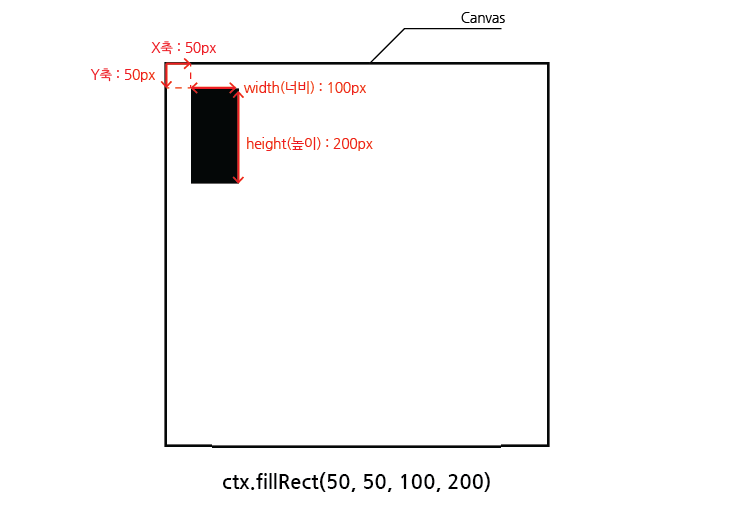
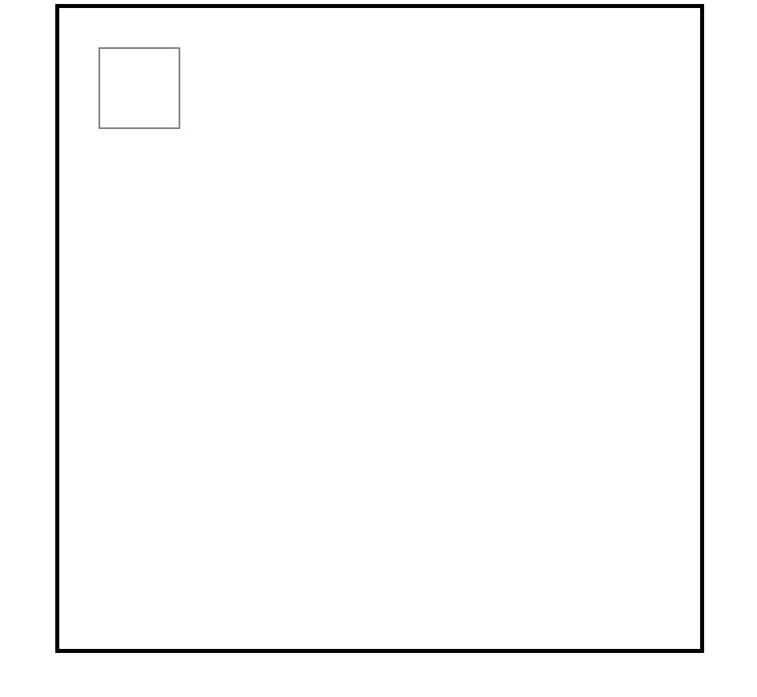
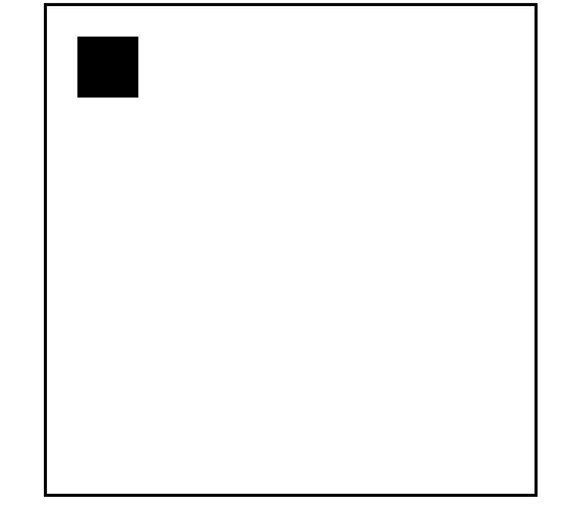
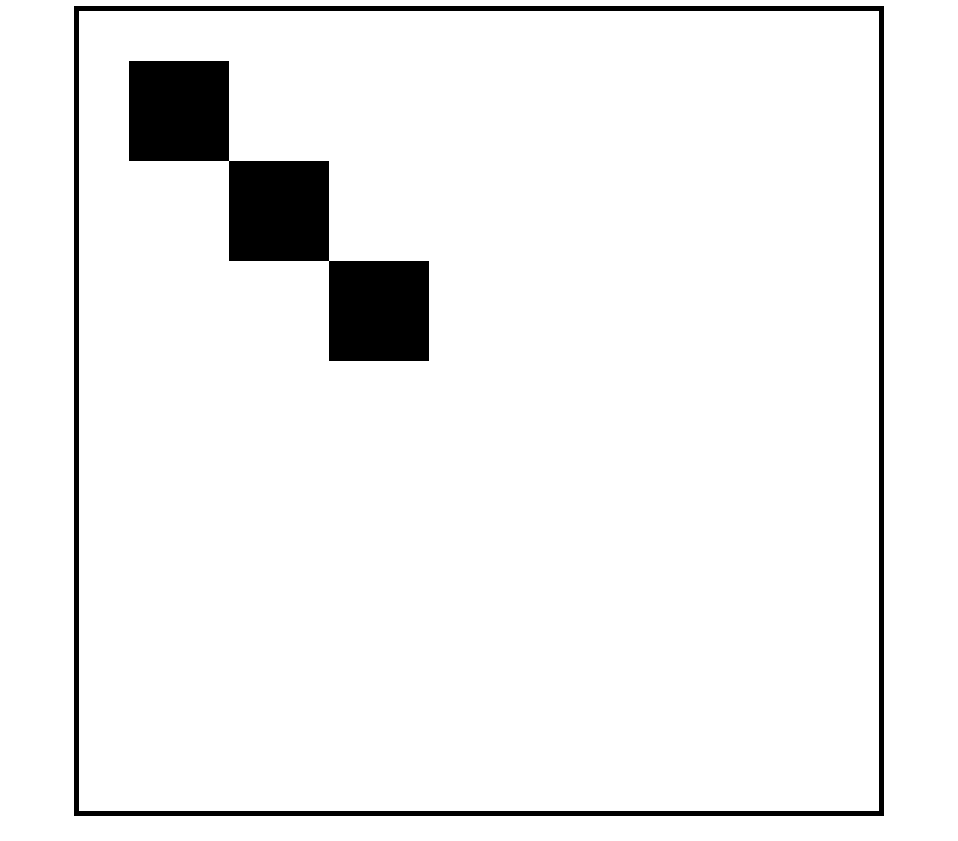
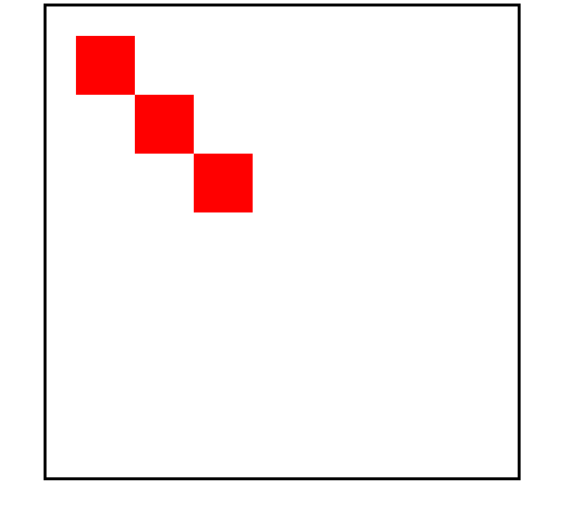
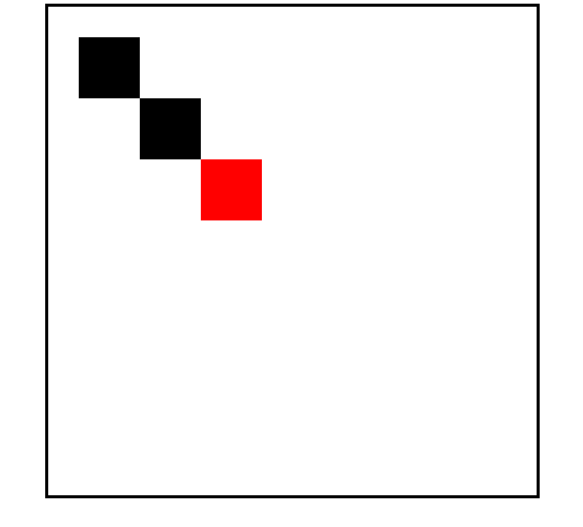
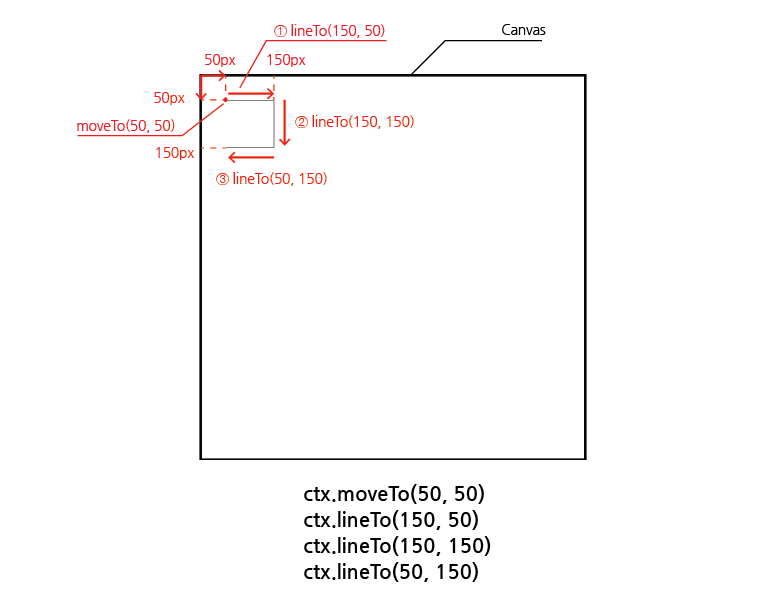
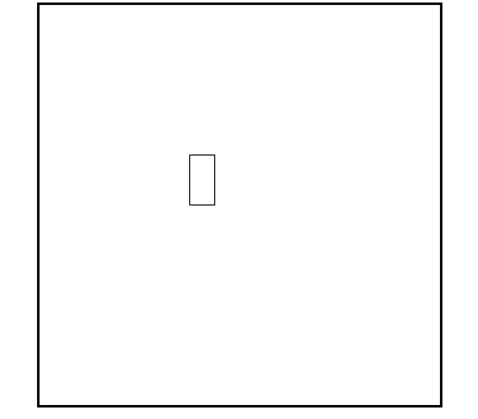
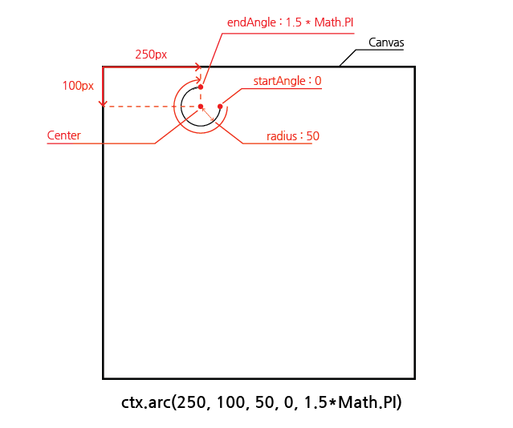
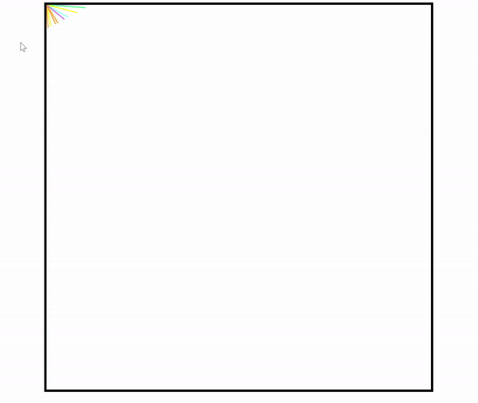

# Canvas

본 프로젝트는 <strong>"nomadcoders_바닐라 JS로 그림 앱 만들기"</strong>를 클론한 프로젝트로 "JavaScript의 Canvas"를 학습하는 것을 목표하였습니다.

## 목차

1. [Canvas API](#1-canvas-api)
    1. [context](#1-1-context)
    2. [Canvas 사이즈](#1-2-canvas-사이즈)
    3. [Canvas의 좌표 시스템](#1-3-canvas의-좌표-시스템)
    4. [fillRect](#1-4-fillrect)
    5. [Path(경로) 개념](#1-5-path경로-개념)
    6. [색상 바꾸기 - style](#1-6-색상-바꾸기---style)
    7. [Path 다시 시작](#1-7-path-다시-시작)
    8. [moveTo & lineTo](#1-8-moveto--lineto)
    9. [굵기 바꾸기 - lineWidth](#1-9-굵기-바꾸기---linewidth)
    10. [arc](#1-10-arc)
2. [Painting Board](#2-painting-board)
    1. [offsetX, offsetY](#2-1-offsetx-offsety)
    2. [mousemove 이벤트](#2-2-mousemove-이벤트)

<br/>
<br/>

## 1. Canvas API

- [MDN 공식 사이트 - Canvas API](https://developer.mozilla.org/en-US/docs/Web/API/Canvas_API)
- JavaScript를 이용하여 WebGL API로 2D 또는 3D 그래픽을 그릴 수 있도록 도와주는 API
- 하드웨어 가속을 지원함
- HTML보다 JavaScript를 이용하여 많은 것을 구현

```html
<!--필요한 html 요소-->

<canvas></canvas>
```

```javascript
// app.js

const canvas = document.querySelector("canvas");
```

<br/>

### 1-1. context

- 그림을 그리는 붓 (페인트 브러쉬)
- getContext()의 argument로 `"2d"` 또는 `"webgl", "bitmaprenderer"` 등을 전달 할 수 있음
- 2D 그래픽을 위해 "2d" 전달
- 3D 그래픽은 "webgl", "bitmaprenderer" 사용

```javascript
// app.js

const canvas = document.querySelector("canvas");
const ctx = canvas.getContext("2d");
```

<br/>

### 1-2. Canvas 사이즈

- CSS를 이용하여 캔버스 사이즈 지정

```css
/*style.css*/

canvas {
    width: 800px;
    height: 800px;
    border: 5px solid black;
}
```

<br/>

- JavaScript에도 캔버스 사이즈를 알려주어야 함

```javascript
// app.js

const canvas = document.querySelector("canvas");
const ctx = canvas.getContext("2d");

canvas.width = 800;
canvas.height = 800;
```

<br/>

### 1-3. Canvas의 좌표 시스템

- Canvas의 좌표는 `좌측상단 코너`를 기준`(0,0)`으로 함
- `가로축`이 `X`, `세로축`이 `Y`임

<br/>

### 1-4. fillRect

- 사각형 채우기
- `ctx.fillRect(X, Y, W, H)`로 4가지의 arguments를 가짐
- X : 기준점에서 가로로 이동
- Y : 기준점에서 세로로 이동
- W : 사각형의 너비
- H : 사각형의 높이

```javascript
// app.js

...
ctx.fillRect(50, 50, 100,200);
```

<br/>

<p align="center">
    <br/>
    <span>fillRect를 사용하여 사각형 그리기</span>
</p>

<br/>

### 1-5. Path(경로) 개념

- rect를 사용하여 아래 코드와 같이 작성하면 사각형을 그릴 수 있으나 선과 면에 색이 적용되지 않아 보이지 않음

```javascript
// app.js

...
ctx.rect(50, 50, 100, 100);
```

<br/>

1. `stroke` 적용

```javascript
// app.js

...
ctx.rect(50, 50, 100, 100);
ctx.stroke();
```

<br/>

<p align="center">
    <br/>
    <span>Rect를 사용하여 사각형 그리고 stroke 적용</span>
</p>

<br/>

2. `fill` 적용

```javascript
// app.js

...
ctx.rect(50, 50, 100, 100);
ctx.fill();
```

<br/>

<p align="center">
    <br/>
    <span>Rect를 사용하여 사각형 그리고 fill 적용</span>
</p>

<br/>

- 여러 개의 사각형을 만들고 fill 적용

```javascript
// app.js

...
ctx.rect(50, 50, 100, 100);
ctx.rect(150, 150, 100, 100);
ctx.rect(250, 250, 100, 100);
ctx.fill();
```

<br/>

<p align="center">
    <br/>
    <span>Rect를 사용하여 여러 개의 사각형 그리고 fill 적용</span>
</p>

<br/>

- 즉, rect(사각형 그리기)와 같이 모양을 그리는 여러 메서드(ex. arc...)가 존재하며, 해당 모양을 만들고 stroke 또는 fill을 해주면 됨

<br/>

### 1-6. 색상 바꾸기 - style

- fillStyle, strokeStyle 속성 등을 사용하여 색상 변경 가능

```javascript
// app.js

...
ctx.rect(50, 50, 100, 100);
ctx.rect(150, 150, 100, 100);
ctx.fill();
ctx.rect(250, 250, 100, 100);
ctx.fillStyle = "red";
ctx.fill();
```

<br/>

<p align="center">
    <br/>
    <span>여러 개의 사각형 그리고 fill 적용한 후, 색상 바꾸고 fill 적용</span>
</p>

- 중간에 fillStyle로 색상을 바꾸고 fill을 적용했지만, 전체 사각형들의 색상이 바뀜
- 모두 같은 경로(path)인 ctx에 묶여있어서 동일하게 적용됨

<br/>

### 1-7. Path 다시 시작

- beginPath() 메서드 사용
- 해당 메서드를 사용할 경우, 앞서 그려진 경로(path)들과 분리되어 다시 새 경로를 시작함

```javascript
// app.js

...
ctx.rect(50, 50, 100, 100);
ctx.rect(150, 150, 100, 100);
ctx.fill();

ctx.beginPath();
ctx.rect(250, 250, 100, 100);
ctx.fillStyle = "red";
ctx.fill();
```

<br/>

<p align="center">
    <br/>
    <span>여러 개의 사각형 그리고 fill 적용한 후, Path 다시 시작하여 색상 바꾸고 fill 적용</span>
</p>

<br/>

### 1-8. moveTo & lineTo

- `moveTo(X, Y)` : (X, Y)좌표로 브러쉬(기준점)를 `이동`
- `lineTo(X, Y)` : 브러쉬(기준점)에서 (X, Y)까지 `선을 만들고` 브러쉬(기준점)를 (X, Y)로 `이동`

```javascript
// app.js

...
ctx.moveTo(50, 50);
ctx.lineTo(150, 50);
ctx.lineTo(150, 150);
ctx.lineTo(50, 150);
ctx.stroke();
```

<br/>

<p align="center">
    <br/>
    <span>moveTo로 기준점 이동 후 선분 3개를 생성 후 stroke 적용</span>
</p>

<br/>

- 즉, `fillRect`는 `rect`와 `fill`로 분리될 수 있으며, `rect`도 `moveTo`와 `lineTo`를 이용하여 그릴 수 있음

<br/>

### 1-9. 굵기 바꾸기 - lineWidth

- 선의 굵기를 조절할 수 있음

```javascript
// app.js

...
ctx.lineWidth = 2;
ctx.strokeRect(300, 300, 50, 100);
```

<br/>

<p align="center">
    <br/>
    <span>lineWidth 값을 통해 굵기 바꾸기</span>
</p>

<br/>

### 1-10. arc

- 원, 호 등을 그릴 수 있음
- arc(X, Y, radius, startAngle, endAngle, counterclockwise)로 구성됨
- [W3S arc 참고자료](https://www.w3schools.com/jsref/canvas_arc.asp)

```javascript
// app.js

...
ctx.arc(250, 100, 50, 0, 1.5 * Math.PI);
ctx.stroke();
```

<br/>

<p align="center">
    <br/>
    <span>arc로 원, 호 그리기</span>
</p>

<br/>
<br/>

## 2. Painting Board

### 2-1. offsetX, offsetY

- canvas에 "Click"의 eventListener를 추가하고 event 콘솔로 출력
- 캔버스 좌측상단을 기준(0,0) 좌표로 하여 offsetX, offsetY 값을 이벤트 값으로 확인가능
- `offsetX` : 기준에서 X축의 거리
- `offsetY` : 기준에서 Y축의 거리

```javascript
// app.js

function onClick(e) {
   console.log(e);
}

canvas.addEventListener("click", onClick);
```

<br/>

### 2-2. mousemove 이벤트

- 마우스 이동 시, 기준점으로부터 마우스까지의 선이 색상이 바뀌면서 그려지도록하기

```javascript
// app.js

...
const colors = [
   "#ff3838",
   "#ffb8b8",
   "#c56cf0",
   "#ff9f1a",
   "#fff200",
   "#32ff7e",
   "#7efff5",
];

function onMove(e) {
   // 색상이 다르게 적용되도록 계속 경로 변경
   ctx.beginPath();
   // 기준점 (0, 0)으로 이동
   ctx.moveTo(0,0);
   // 색상 랜덤으로 선택
   const color = colors[Math.floor(Math.random() * colors.length)];
   // 선스타일 색상 변경
   ctx.strokeStyle = color;
   // 기준점에서 마우스 위치까지 선분 생성
   ctx.lineTo(e.offsetX, e.offsetY);
   // 선 그리기
   ctx.stroke();
}

canvas.addEventListener("mousemove", onMove);
```

<br/>

<p align="center">
    <br/>
    <span>마우스 이동하면서 랜덤 색상의 선 그리기</span>
</p>
