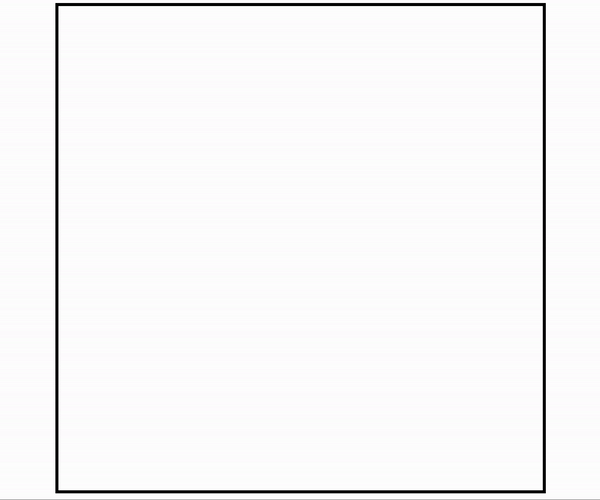
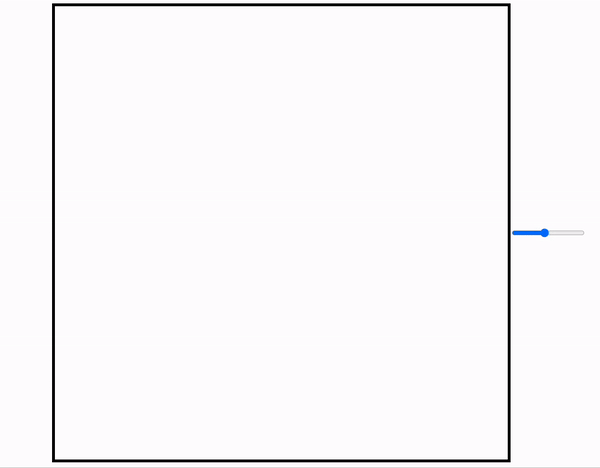
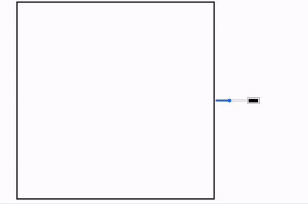
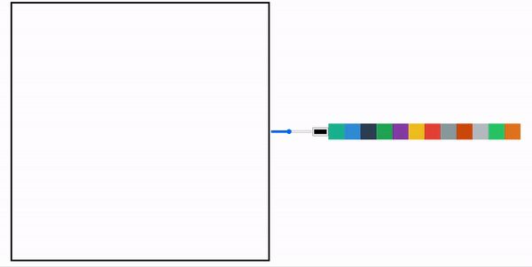
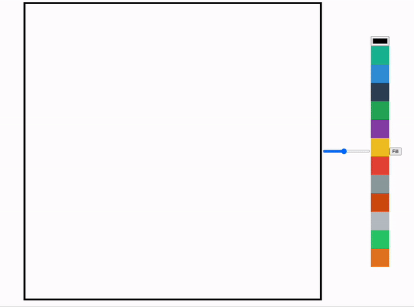
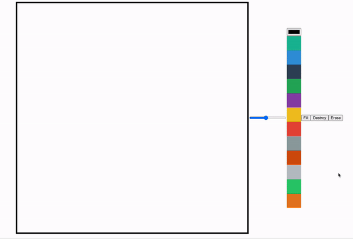

# Canvas

본 프로젝트는 <strong>"nomadcoders_바닐라 JS로 그림 앱 만들기"</strong>를 클론한 프로젝트로 "JavaScript의 Canvas"를 학습하는 것을 목표하였습니다.

## 목차

1. [Canvas API](#1-canvas-api)
    1. [context](#1-1-context)
    2. [Canvas 사이즈](#1-2-canvas-사이즈)
    3. [Canvas의 좌표 시스템](#1-3-canvas의-좌표-시스템)
    4. [fillRect](#1-4-fillrect)
    5. [Path(경로) 개념](#1-5-path경로-개념)
    6. [색상 바꾸기 - style](#1-6-색상-바꾸기---style)
    7. [Path 다시 시작](#1-7-path-다시-시작)
    8. [moveTo & lineTo](#1-8-moveto--lineto)
    9. [굵기 바꾸기 - lineWidth](#1-9-굵기-바꾸기---linewidth)
    10. [arc](#1-10-arc)
2. [Painting Board](#2-painting-board)
    1. [마우스 위치 - offsetX, offsetY](#2-1-마우스-위치---offsetx-offsety)
    2. [mousemove 이벤트](#2-2-mousemove-이벤트)
    3. [기본 그림판 만들기 - mousemove, mousedown, mouseup](#2-3-기본-그림판-만들기---mousemove-mousedown-mouseup)
    4. [버그 해결 - mouseleave](#2-4-버그-해결---mouseleave)
    5. [굵기 조절 input 만들기 - line Width](#2-5-굵기-조절-input-만들기---line-width)
    6. [색상 팔레트 input 만들기 - strokeStyle](#2-6-색상-팔레트-input-만들기---strokestyle)
    7. [색상 선택 옵션 만들기](#2-7-색상-선택-옵션-만들기)
    8. [색상 채우기](#2-8-색상-채우기)
    9. [초기화 및 지우개](#2-9-초기화-및-지우개)

<br/>
<br/>

## 1. Canvas API

- [MDN 공식 사이트 - Canvas API](https://developer.mozilla.org/en-US/docs/Web/API/Canvas_API)
- JavaScript를 이용하여 WebGL API로 2D 또는 3D 그래픽을 그릴 수 있도록 도와주는 API
- 하드웨어 가속을 지원함
- HTML보다 JavaScript를 이용하여 많은 것을 구현

```html
<!--필요한 html 요소-->

<canvas></canvas>
```

```javascript
// app.js

const canvas = document.querySelector("canvas");
```

<br/>

### 1-1. context

- 그림을 그리는 붓 (페인트 브러쉬)
- getContext()의 argument로 `"2d"` 또는 `"webgl", "bitmaprenderer"` 등을 전달 할 수 있음
- 2D 그래픽을 위해 "2d" 전달
- 3D 그래픽은 "webgl", "bitmaprenderer" 사용

```javascript
// app.js

const canvas = document.querySelector("canvas");
const ctx = canvas.getContext("2d");
```

<br/>

### 1-2. Canvas 사이즈

- CSS를 이용하여 캔버스 사이즈 지정

```css
/*style.css*/

canvas {
    width: 800px;
    height: 800px;
    border: 5px solid black;
}
```

<br/>

- JavaScript에도 캔버스 사이즈를 알려주어야 함

```javascript
// app.js

const canvas = document.querySelector("canvas");
const ctx = canvas.getContext("2d");

canvas.width = 800;
canvas.height = 800;
```

<br/>

### 1-3. Canvas의 좌표 시스템

- Canvas의 좌표는 `좌측상단 코너`를 기준`(0,0)`으로 함
- `가로축`이 `X`, `세로축`이 `Y`임

<br/>

### 1-4. fillRect

- 사각형 채우기
- `ctx.fillRect(X, Y, W, H)`로 4가지의 arguments를 가짐
- X : 기준점에서 가로로 이동
- Y : 기준점에서 세로로 이동
- W : 사각형의 너비
- H : 사각형의 높이

```javascript
// app.js

...
ctx.fillRect(50, 50, 100,200);
```

<br/>

<p align="center">
    <br/>
    <span>fillRect를 사용하여 사각형 그리기</span>
</p>

<br/>

### 1-5. Path(경로) 개념

- rect를 사용하여 아래 코드와 같이 작성하면 사각형을 그릴 수 있으나 선과 면에 색이 적용되지 않아 보이지 않음

```javascript
// app.js

...
ctx.rect(50, 50, 100, 100);
```

<br/>

1. `stroke` 적용

```javascript
// app.js

...
ctx.rect(50, 50, 100, 100);
ctx.stroke();
```

<br/>

<p align="center">
    <br/>
    <span>Rect를 사용하여 사각형 그리고 stroke 적용</span>
</p>

<br/>

2. `fill` 적용

```javascript
// app.js

...
ctx.rect(50, 50, 100, 100);
ctx.fill();
```

<br/>

<p align="center">
    <br/>
    <span>Rect를 사용하여 사각형 그리고 fill 적용</span>
</p>

<br/>

- 여러 개의 사각형을 만들고 fill 적용

```javascript
// app.js

...
ctx.rect(50, 50, 100, 100);
ctx.rect(150, 150, 100, 100);
ctx.rect(250, 250, 100, 100);
ctx.fill();
```

<br/>

<p align="center">
    <br/>
    <span>Rect를 사용하여 여러 개의 사각형 그리고 fill 적용</span>
</p>

<br/>

- 즉, rect(사각형 그리기)와 같이 모양을 그리는 여러 메서드(ex. arc...)가 존재하며, 해당 모양을 만들고 stroke 또는 fill을 해주면 됨

<br/>

### 1-6. 색상 바꾸기 - style

- fillStyle, strokeStyle 속성 등을 사용하여 색상 변경 가능

```javascript
// app.js

...
ctx.rect(50, 50, 100, 100);
ctx.rect(150, 150, 100, 100);
ctx.fill();
ctx.rect(250, 250, 100, 100);
ctx.fillStyle = "red";
ctx.fill();
```

<br/>

<p align="center">
    <br/>
    <span>여러 개의 사각형 그리고 fill 적용한 후, 색상 바꾸고 fill 적용</span>
</p>

- 중간에 fillStyle로 색상을 바꾸고 fill을 적용했지만, 전체 사각형들의 색상이 바뀜
- 모두 같은 경로(path)인 ctx에 묶여있어서 동일하게 적용됨

<br/>

### 1-7. Path 다시 시작

- beginPath() 메서드 사용
- 해당 메서드를 사용할 경우, 앞서 그려진 경로(path)들과 분리되어 다시 새 경로를 시작함

```javascript
// app.js

...
ctx.rect(50, 50, 100, 100);
ctx.rect(150, 150, 100, 100);
ctx.fill();

ctx.beginPath();
ctx.rect(250, 250, 100, 100);
ctx.fillStyle = "red";
ctx.fill();
```

<br/>

<p align="center">
    <br/>
    <span>여러 개의 사각형 그리고 fill 적용한 후, Path 다시 시작하여 색상 바꾸고 fill 적용</span>
</p>

<br/>

### 1-8. moveTo & lineTo

- `moveTo(X, Y)` : (X, Y)좌표로 브러쉬(기준점)를 `이동`
- `lineTo(X, Y)` : 브러쉬(기준점)에서 (X, Y)까지 `선을 만들고` 브러쉬(기준점)를 (X, Y)로 `이동`

```javascript
// app.js

...
ctx.moveTo(50, 50);
ctx.lineTo(150, 50);
ctx.lineTo(150, 150);
ctx.lineTo(50, 150);
ctx.stroke();
```

<br/>

<p align="center">
    <br/>
    <span>moveTo로 기준점 이동 후 선분 3개를 생성 후 stroke 적용</span>
</p>

<br/>

- 즉, `fillRect`는 `rect`와 `fill`로 분리될 수 있으며, `rect`도 `moveTo`와 `lineTo`를 이용하여 그릴 수 있음

<br/>

### 1-9. 굵기 바꾸기 - lineWidth

- 선의 굵기를 조절할 수 있음

```javascript
// app.js

...
ctx.lineWidth = 2;
ctx.strokeRect(300, 300, 50, 100);
```

<br/>

<p align="center">
    <br/>
    <span>lineWidth 값을 통해 굵기 바꾸기</span>
</p>

<br/>

### 1-10. arc

- 원, 호 등을 그릴 수 있음
- arc(X, Y, radius, startAngle, endAngle, counterclockwise)로 구성됨
- [W3S arc 참고자료](https://www.w3schools.com/jsref/canvas_arc.asp)

```javascript
// app.js

...
ctx.arc(250, 100, 50, 0, 1.5 * Math.PI);
ctx.stroke();
```

<br/>

<p align="center">
    <br/>
    <span>arc로 원, 호 그리기</span>
</p>

<br/>
<br/>

## 2. Painting Board

### 2-1. 마우스 위치 - offsetX, offsetY

- canvas에 "Click"의 eventListener를 추가하고 event 콘솔로 출력
- 캔버스 좌측상단을 기준(0,0) 좌표로 하여 offsetX, offsetY 값을 이벤트 값으로 확인가능
- `offsetX` : 기준에서 X축의 거리
- `offsetY` : 기준에서 Y축의 거리

```javascript
// app.js

function onClick(e) {
   console.log(e);
}

canvas.addEventListener("click", onClick);
```

<br/>

### 2-2. mousemove 이벤트

- 마우스 이동 시, 기준점으로부터 마우스까지의 선이 색상이 바뀌면서 그려지도록하기

```javascript
// app.js

...
const colors = [
   "#ff3838",
   "#ffb8b8",
   "#c56cf0",
   "#ff9f1a",
   "#fff200",
   "#32ff7e",
   "#7efff5",
];

function onMove(e) {
   // 색상이 다르게 적용되도록 계속 경로 변경
   ctx.beginPath();
   // 기준점 (0, 0)으로 이동
   ctx.moveTo(0,0);
   // 색상 랜덤으로 선택
   const color = colors[Math.floor(Math.random() * colors.length)];
   // 선스타일 색상 변경
   ctx.strokeStyle = color;
   // 기준점에서 마우스 위치까지 선분 생성
   ctx.lineTo(e.offsetX, e.offsetY);
   // 선 그리기
   ctx.stroke();
}

canvas.addEventListener("mousemove", onMove);
```

<br/>

<p align="center">
    <br/>
    <span>마우스 이동하면서 랜덤 색상의 선 그리기</span>
</p>

<br/>

### 2-3. 기본 그림판 만들기 - mousemove, mousedown, mouseup

- `moveTo()`, `lineTo()`, `stroke()`, `mousemove`, `mousedown`, `mouseup`를 사용하여 기본적인 그림판 만들기

```js
// app.js

const canvas = document.querySelector("canvas");
const ctx = canvas.getContext("2d");
canvas.width = 800;
canvas.height = 800;

ctx.lineWidth = 2;

// 현재 그림을 그리는 중인지 판단하는 변수 isPainting 생성
// 초기값 false
let isPainting = false;

// 마우스가 이동할 때 실행할 함수
function onMove(e) {
   // 그림을 그리는 중이면
   if (isPainting === true) {
      // 마우스 위치로 선을 생성하고
      ctx.lineTo(e.offsetX, e.offsetY);
      // 선을 stroke로 그리기
      ctx.stroke();
      return;
   }
   // 그림을 그리는 중이 아니면 기준점 이동시키기
   ctx.moveTo(e.offsetX, e.offsetY);
}

// 마우스 버튼일 눌릴 때 실행할 함수
function onMousedown() {
   // 그림을 그리는 중
   isPainting = true;
}

// 마우스 버튼을 뗄 때 실행할 함수
function onMouseup() {
   // 그림 그리지 않는 중
   isPainting = false;
}

// 마우스가 움직일 때, 마우스 버튼이 눌려있을 때, 마우스 버튼을 뗄 때, 각 이벤트 생성
canvas.addEventListener("mousemove", onMove);
canvas.addEventListener("mousedown", onMousedown);
canvas.addEventListener("mouseup", onMouseup);
```

<br/>

<p align="center">
    <br/>
    <span>기본적인 그림판</span>
</p>

- 하지만, 해당 코드에는 문제점이 있음
- 마우스 버튼을 눌러 그림을 그리는 채로 마우스를 캔버스 밖으로 이동한 뒤, 버튼을 떼고 다시 캔버스로 이동하면 버튼을 누르는 상황이 아님에도 그림이 계속 그려지는 버그 발생
- 이는 canvas에 한해서 mouseup 이벤트가 생성되어있기 때문에 canvas 밖에서 버튼을 떼는 것을 canvas는 인식하지 못함

<br/>

### 2-4. 버그 해결 - mouseleave

- `canvas`에 `mouseleave` 이벤트를 생성하여 마우스가 떠났을 때를 감지하여 cancelPainting 함수 실행
- 또는 `document` 자체에 `mouseup` 이벤트를 생성하여 문서에서 항상 마우스를 떼면 cancelPainting 함수 실행

```js
// app.js

...
function cancelPainting() {
   isPainting = false;
}

canvas.addEventListener("mouseleave", cancelPainting);
// 또는
document.addEventListener("mouseup", cancelPainting);
```

<br/>

### 2-5. 굵기 조절 input 만들기 - line Width

- 그림판에서 선 굵기 조절 range 타입 input 만들기

```html
<!--index.html-->

<input id="line-width" type="range" min="1" max="10" value="5" step="0.5" />
```

- input에 `change` 이벤트를 통해 range 값이 변할 때마다 `onLineWidthChange` 함수 실행
- onLineWidthChange 함수는 슬라이더 값을 캔버스 `브러쉬의 굵기`로 설정
- 하지만 onLineWidChange 함수까지만 설정하면 그림판에 그려놓은 모든 선들의 굵기가 해당 굵기 값으로 변경되는 버그가 발생함
- 따라서 그림을 그리지 않고 있는 중인 경우, 그리기가 끝난 경우의 함수에 `beginPath()`를 통해 이전 생성된 선들과의 경로를 끊기
- 그렇게 하면 버그 해결됨

```js
// app.js

const lineWidth = document.querySelector("#line-width");

...

ctx.lineWidth = lineWidth.value;

...

function onMove(e) {
   if (isPainting === true) {
      ctx.lineTo(e.offsetX, e.offsetY);
      ctx.stroke();
      return;
   }
   ctx.beginPath();
   ctx.moveTo(e.offsetX, e.offsetY);
}

function cancelPainting() {
   isPainting = false;
   ctx.beginPath();
}

function onLineWidthChange(e) {
   ctx.lineWidth = e.target.value;
}

lineWidth.addEventListener("change", onLineWidthChange);
```

<br/>

<p align="center">
    <br/>
    <span>그림판 브러쉬 굵기 변경</span>
</p>

<br/>

### 2-6. 색상 팔레트 input 만들기 - strokeStyle

- 그림판에서 색상 조절 color 타입 input 만들기

```html
<!--index.html-->

<input id="color" type="color" />
```

```js
// app.js

...
const color = document.querySelector("#color");

...
function onColorChange(e) {
   ctx.strokeStyle = e.target.value;
   ctx.fillStyle = e.target.value;
}

color.addEventListener("change", onColorChange);
```

<br/>

<p align="center">
    <br/>
    <span>그림판 브러쉬 색상 변경</span>
</p>

<br/>

### 2-7. 색상 선택 옵션 만들기

- input외에 색상을 선택할 수 있는 옵션 만들기

```html
<!--index.html-->

...
<!--각 요소 옵션의 data-color 속성에 색상 값 담기-->
<div class="color-option" style="background-color: #1abc9c;" data-color="#1abc9c"></div>
<div class="color-option" style="background-color: #3498db;" data-color="#3498db"></div>
<div class="color-option" style="background-color: #34495e;" data-color="#34495e"></div>
<div class="color-option" style="background-color: #27ae60;" data-color="#27ae60"></div>
<div class="color-option" style="background-color: #8e44ad;" data-color="#8e44ad"></div>
<div class="color-option" style="background-color: #f1c40f;" data-color="#f1c40f"></div>
<div class="color-option" style="background-color: #e74c3c;" data-color="#e74c3c"></div>
<div class="color-option" style="background-color: #95a5a6;" data-color="#95a5a6"></div>
<div class="color-option" style="background-color: #d35400;" data-color="#d35400"></div>
<div class="color-option" style="background-color: #bdc3c7;" data-color="#bdc3c7"></div>
<div class="color-option" style="background-color: #2ecc71;" data-color="#2ecc71"></div>
<div class="color-option" style="background-color: #e67e22;" data-color="#e67e22"></div>
```

```css
/* style.css */

.color-option {
   width: 50px;
   height: 50px;
   cursor: pointer;
}
```

```js
// app.js

...

// color-option 클래스를 가진 요소를 다 선택하여 배열로 담기
const colorOptions = Array.from(document.querySelectorAll(".color-option"));

...
function onColorClick(e) {
   // HTML에서 담은 data-color="색상" 값 가져오기
   const colorValue = e.target.dataset.color;
   ctx.strokeStyle = colorValue;
   ctx.fillStyle = colorValue;
   
   // 어떤 색상을 선택했는지 피드백을 주기위해 color input의 색상도 변경시키기
   color.value = colorValue;
}

// 배열인 colorOptions를 forEach로 순회하며 각 요소에 "click" 이벤트 생성
colorOptions.forEach(color => color.addEventListener("click", onColorClick));
```

<br/>

<p align="center">
    <br/>
    <span>그림판 브러쉬 색상 옵션 변경</span>
</p>

<br/>

### 2-8. 색상 채우기

- mode를 Fill과 Draw로 토글 할 수 있는 버튼을 생성하여 Fill 모드에서는 canvas를 클릭하면 전체를 채우고, Draw 모드에서는 기존의 선을 그리는 방식으로 만들기

```html
<!--index.html-->

<button id="mode-btn">Fill</button>
```

```js
// app.js

...
const modeBtn = document.querySelector("#mode-btn");

...
// 현재 Fill모드인지 Draw모드인지 확인할 수 있는 isFilling 변수 생성
let isFilling = false;

...
// 버튼에 click 이벤트 생성
// 버튼 클릭 시, 모드 확인 변수 isFilling을 토글하고 버튼의 글자도 바꾸기
function onModeClick() {
   if (isFilling) {
      isFilling = false;
      modeBtn.innerText = "Fill";
   } else {
      isFilling = true;
      modeBtn.innerText = "Draw";
   }
}

modeBtn.addEventListener("click", onModeClick);


...
// 캔버스에 click 이벤트 생성
// 캔버스 클릭 시, 현재 Fill 모드 이면 캔버스 전체를 fillRect를 이용해 색 채우기
function onCanvasClick() {
   if (isFilling) {
      ctx.fillRect(0, 0, canvas.width, canvas.height);
   }
}

canvas.addEventListener("click", onCanvasClick);
```

<br/>

<p align="center">
    <br/>
    <span>그림판 채우기</span>
</p>

<br/>

### 2-9. 초기화 및 지우개

- 그림판 초기화 버튼 만들기 (= 하얀색으로 채우기)
- 지우개 모드 버튼 만들기 (= 하얀색으로 선그리기)

<br/>

1. 그림판 초기화

```html
<!--index.html-->

<button id="destroy-btn">Destroy</button>
```

```js
// app.js

...
const destroyBtn = document.querySelector("#destroy-btn");

...
const CANVAS_WIDTH = 800;
const CANVAS_HEIGHT = 800;

...
function onDestroyClick() {
   // 채우기 색상 하얀색으로 설정
   ctx.fillStyle = "white";
   // 캔버스 사각형 하얀색으로 채우기
   ctx.fillRect(0, 0, CANVAS_WIDTH, CANVAS_HEIGHT);
}

destroyBtn.addEventListener("click", onDestroyClick);
```

<br/>

2. 지우개

```html
<!--index.html-->

<button id="eraser-btn">Erase</button>
```

```js
// app.js

...
const eraserBtn = document.querySelector("#eraser-btn");

...
function onEraserClick() {
   // 선 색상을 하얀색으로 설정
   ctx.strokeStyle = "white";
   
   // 지우개 모드일 경우, Fill모드를 Draw모드로 변경
   isFilling = false;
   modeBtn.innerText = "Fill";
}

eraserBtn.addEventListener("click", onEraserClick);
```

<br/>

<p align="center">
    <br/>
    <span>그림판 초기화 및 지우개</span>
</p>

<br/>